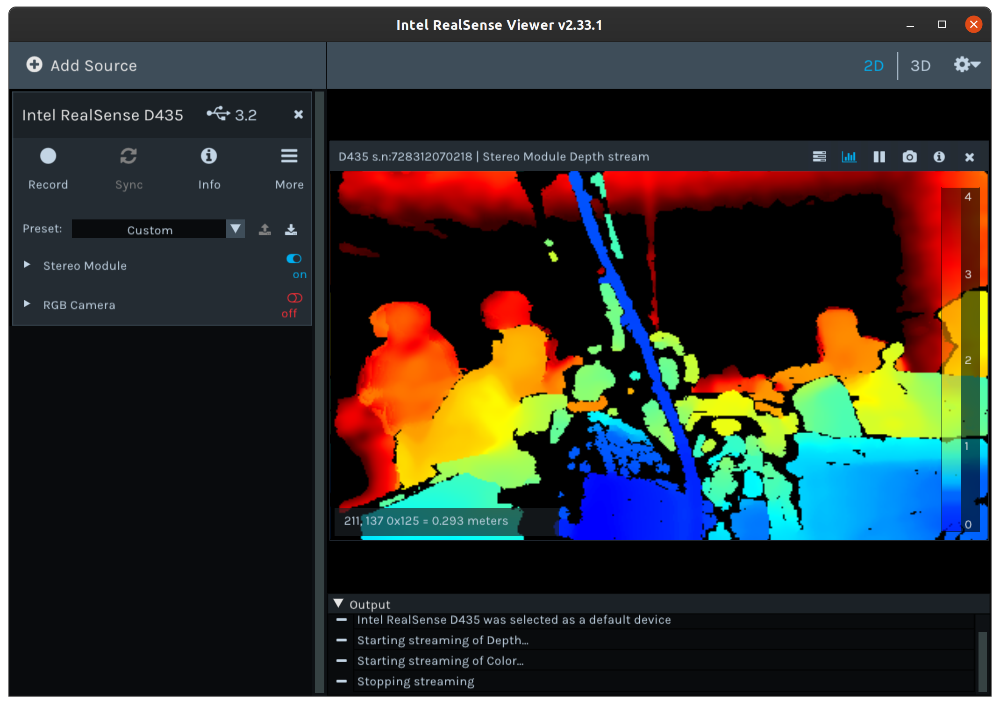

# UCSD-ECE148-WI20-TEAM6
OpenSource Code for Donkey/Realsense Object Detection Interface

Contributions: 

Brian Rush, Aaron Hanna, Stephen Lien

---
## ROS/SLAM
#### Useful Link
[ROS/SLAM](https://mc.ai/intel-realsense-3d-camera-for-robotics-slam-with-code/)
> Run the command: roslaunch ~/slam.launch
> > Note: To view this in vnc use 'rviz = true' argument after command
> > 
> > example: roslaunch ~/slam.launch rviz = true
> > 
> > Make sure vncserver.sh is ran before using rviz!
>
> Make sure this is from home directory as the file is located there
>
---
## Object Detection (.py)
Inputs: Camera(rgb, depth, infra)

Outputs: Objects data
### Camera Information
*Realsense D435 Camera* takes in depth image data as scalar values that
can be multiplied by the depth_scale of the camera(intrinsics)

### Scope
Ideally, will take in camera data (rgb, depth,infra) as input
and return objects and their location along with height and distance
information.

#### RGB vs Depth

#### Depth
RealSense Viewer [Install Link](https://github.com/IntelRealSense/librealsense/blob/master/doc/installation.md)

#### Tutorials
[Librealsense Python Wrapper](https://github.com/IntelRealSense/librealsense/tree/master/wrappers/python)

#### Useful Commands

---
## Object Avoidance
>Inputs: Objects data from Object_Detection class
>
>Outputs: Steering, Throttle
>
>

---
### Uploading to Git: Commands
>git add . (uploads all files)
>
>git add -u (adds updated files)
>
>git commit -a -m "insert message here" (adds added files with message)
>
>git push (pushes to master branch)
---
#### Notes to self
1. Make sure images are **aligned**
